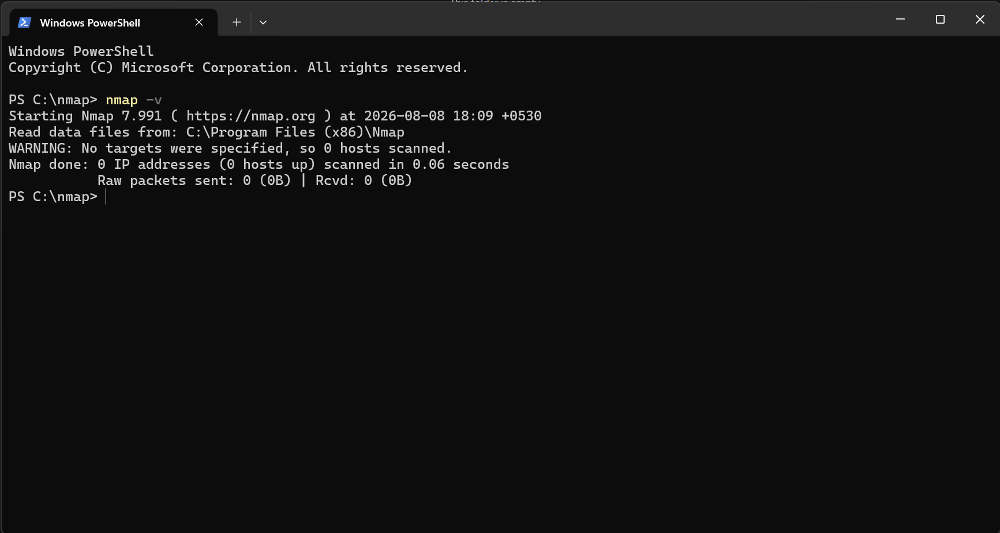
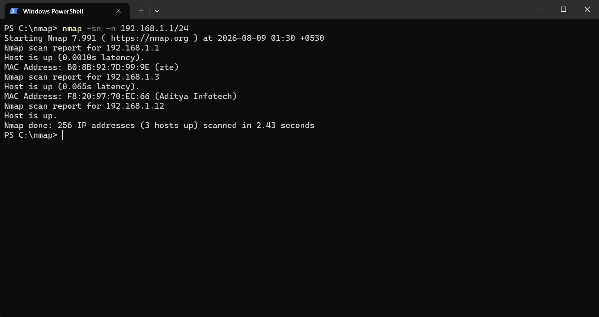
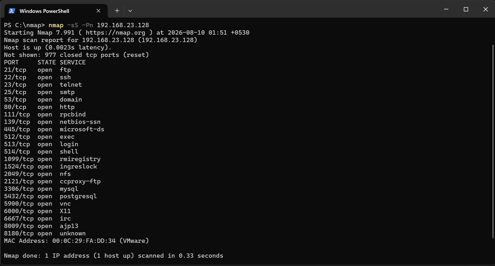
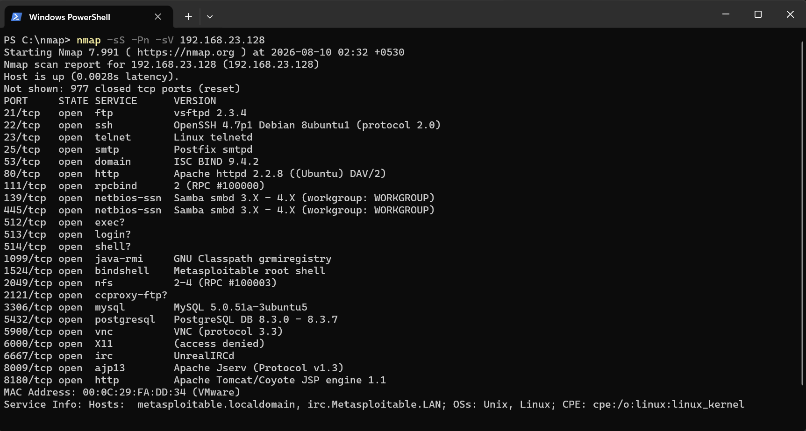
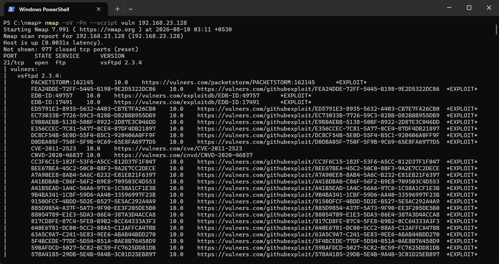
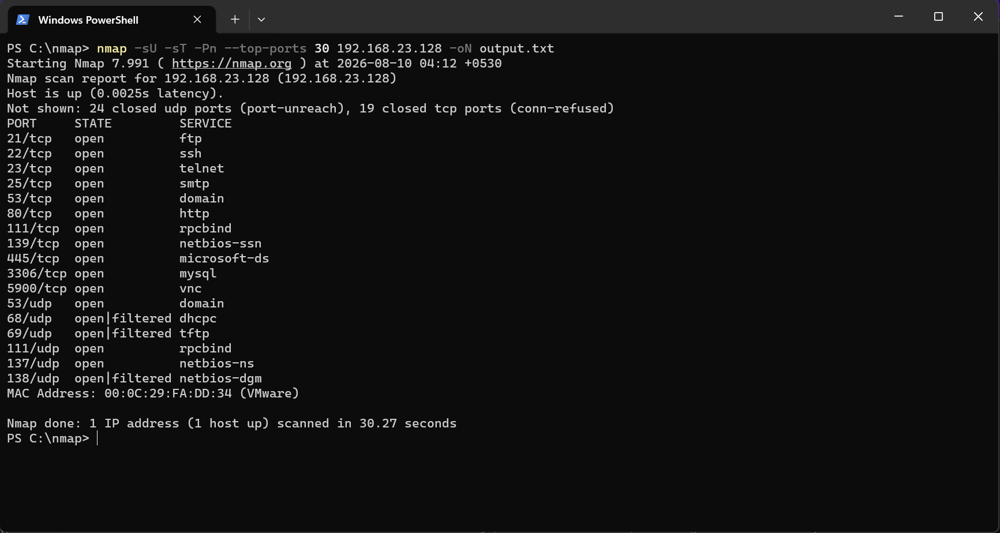

# Nmap Network Discovery 
## Overview
This project demonstrates the use of Nmap for network discovery, port scanning, and service enumeration in an authorized lab environment.
## Lab Environment 
- Operating System: Windows
- Tool: Nmap
- Environment Home Network
## Objectives
- Verify Nmap installation
- Discover active hosts
- Identitfy open ports
- Detect running services
- Understand basic network enumeration

# Nmap Installation Verification

<p align ='center'>
  01-nmap_version.png
</p>

### Command
```bash
nmap --version
```

## Observation
- Verified that nmap was installed successfully.
- The installed version and supported libaries were displayed.
- The tool is ready for network scanning tasks.

## Why is this important?
- Verifying the installation ensure that Nmap is correctly configured before performing any scans.
- It confirms that the required components are available.
## What I Learned
- How to verify a successful Nmap installation.
- How to check installed version from the command line.

# Hosts Discovery


<p align ="center">
  02-hosts_discovery.png
</p>

## Command
```bash
nmap -sn -n 192.168.23.0/24
```

## What it does
Finds all live devices on the `192.168.23.0/24` network without scanning ports.

## Parameters

| Flag | Meaning |
|------|---------|
| `-sn` | Only checks which hosts are up (no port scan) |
| `-n` | Skips DNS lookup, makes scan faster |
| `192.168.23.0`| Target IP of subnet mask |
| `/24` | Scans the whole subnet (192.168.1.0–255), not just `.1` |

## Observation
- Output shows only **IP + MAC address** of live hosts (no ports/services/dns, since `-sn` & `-n` skips that).

## Why is this Important?
- Host discovery is always the **first step** before any port/service scan — no point scanning ports on a dead IP.
- ARP works at Layer 2, so it's more reliable than ping on a local network.
- This connects to Wireshark too — the ARP requests from this scan show up live with:

## What I Learned
- How Nmap performs basic host discovery.
- How to interpret `Host is up` in Nmap output.
- How CIDR notation such as `/24` defines a network range.
- How the `-sn` option focuses the scan on host discovery.
- How the `-n` option disables DNS resolution.

# TCP SYN Port Scan

<p align="center">
  03-tcp_syn_port_scan.png
</p>

## Command
```bash
nmap -sS -Pn 192.168.23.128
```

## Parameters

| Flag | Meaning |
|------|---------|
| `-sS` | SYN scan ("half-open" scan) — faster and less detectable than a full TCP connect scan |
| `-Pn` | Skips host discovery (ping) and assumes the host is up — scans anyway |
| `192.168.23.128` | Target IP (Metasploitable2 VM) |

## Observation

- Host was up, 977 ports closed, **23 ports found open**
- Scan completed in 0.33 seconds
Notable open ports:
 
| Port | Service | 
|------|---------|
| 21 | ftp |
| 23 | telnet | 
| 139/445 | netbios-ssn / microsoft-ds | 
| 512/513/514 | exec/login/shell |
| 1524 | ingreslock | 
| 3306 | mysql | 
| 5900 | vnc |
| 6667 | irc | 
| XXXX | xyzport |

## Why is this Important?
`-Pn`Some hosts (or firewalls) block ICMP ping, which would normally make Nmap skip the host as "down" even if it's actually up. `-Pn` forces Nmap to scan regardless of ping response — useful when scanning VMs or hosts with ICMP disabled.

## What I Learned
- `-sS` is fast and quiet because it doesn't finish the full connection — it just knocks and checks if the door is open.
- `-Pn` helps when a host blocks ping — without it, Nmap might think the host is "down" and skip it completely.

# Service & Version Detection 

<p align="center">04-service_&_version_detection.png</p>

## Commands
```bash
nmap -sS -Pn -sV 192.168.23.128
```

## Parameters
 
| Flag | Meaning |
|------|---------|
| `-sS` | SYN scan — checks which ports are open |
| `-Pn` | Skips ping check, scans anyway |
| `-sV` | Detects service name + version on each open port |
| `192.168.23.128` | Target IP (Metasploitable2 VM) |

## Observation
23 open ports found, now with exact versions. A few stand out as **known-vulnerable, textbook-insecure versions**:
 
| Port | Service | Version | Why it's notable |
|------|---------|---------|-------------------|
| 21 | ftp | vsftpd 2.3.4 | A famous backdoored version — widely used as a teaching example |
| 23 | telnet | Linux telnetd | Sends everything (including passwords) in plain text |
| 512–514 | exec/login/shell | (r-services) | Old, weakly authenticated remote access tools |
| 1524 | bindshell | **"Metasploitable root shell"** | Nmap itself labels this — a shell left open on purpose |
| 3306 | mysql | MySQL 5.0.51a | Old version, database exposed to the network |
| 5432 | postgresql | PostgreSQL 8.3.0–8.3.7 | Old version |
| 6667 | irc | UnrealIRCd | A version of this IRC server had a well-known backdoor |
| 80 / 8180 | http | Apache 2.2.8 / Tomcat | Old web server versions |

## Why is this Important?
- Just knowing a port is "open" isn't enough — the **version** is what actually tells you if something is exploitable. Two machines can have the same open port but very different risk depending on the software version.


## What I Learned
- `-sV` is the step that turns a plain port list into something actually useful — it's what you'd check *after* finding open ports.
- A lot of these versions (vsftpd 2.3.4, UnrealIRCd, old MySQL/PostgreSQL) are famous specifically *because* they have known, public exploits — seeing them helps connect scan output to real vulnerabilities.

# Vulnerability Scan (NSE `vuln` scripts)

<p align=center>05-vulnerability_scan.png</p>

## Command
```bash
nmap -sV -Pn --script vuln 192.168.23.128
```

## Parameters
 
| Flag | Meaning |
|------|---------|
| `-sV` | Detects service name + version on each open port |
| `-Pn` | Skips ping check, scans anyway |
| `--script vuln` | Runs all NSE scripts in the "vuln" category — checks for known vulnerabilities |
| `192.168.23.128` | Target IP (Metasploitable2 VM) |
## Observation
- Checks the exact service versions found earlier against known, public vulnerability databases — and lists any matching exploits/CVEs for each one.
- `NSE stands` for the Nmap Scripting Engine.

## Why is this Important?
-This command matters because it goes beyond just showing open ports — it checks if the services running on them have known, publicly exploitable vulnerabilities, helping identify which issues need to be fixed first.
## What I Learned
- `--script vuln` takes version detection one step further — instead of me manually looking up "is vsftpd 2.3.4 vulnerable?", Nmap cross-checks it automatically against vulnerability databases.
- In a real environment, a finding like this would mean: patch/upgrade the service immediately, since public exploits are freely available for anyone to find.

# Scan with Save Report

<p align='center'>06-scan_with_save_report.png</p>

## Command
```bash
nmap -sU -sT -Pn --top-ports 30 192.168.23.128 -oN output.txt
```
## Parameters
 
| Flag | Meaning |
|------|---------|
| `-sU` | UDP scan — checks UDP ports (used by services like DNS, DHCP, NetBIOS) |
| `-sT` | TCP Connect scan — checks TCP ports using a full handshake (doesn't need admin/raw-socket access like `-sS`) |
| `-Pn` | Skips the ping check, scans anyway |
| `--top-ports 30` | Scans the top 30 most common ports, for both protocols |
| `192.168.23.128` | Target IP (Metasploitable2) |
| `-oN output.txt` | Saves the full output to `output.txt` in normal (readable) format |

## Observation
- This command scanned both TCP and UDP protocols, but limited to the top 30 most common ports for each, and saved the full result to output.txt instead of just showing it in the terminal.

## Why is this Important?
- Scanning both TCP and UDP gives a complete picture of exposed services — a TCP-only scan would have missed UDP-based services like DNS and NetBIOS.
- Saving output with -oN makes the scan a documented, shareable record instead of a one-time terminal output — a common practice in real security reporting.

## What I Learned
- TCP and UDP behave differently — UDP has no handshake, so results are often `open|filtered` instead of a clear open/closed.
- Combining `-sU` and `-sT` roughly doubles scan time, since both checks run one after another.
- `oN` output.txt saves the full result as a clean file instead of a scrolling terminal screenshot.

# LAB SETUP
- Hypervisor: VMware Workstation.
- Attacker/Scanner Machine: Windows host (Nmap run directly from PowerShell).
- Target Machine: `Metasploitable2` (intentionally vulnerable Linux VM).
- Network Mode: Host-only — keeps the target isolated from the real network while still allowing the Windows host to scan it directly.
- Target IP: `192.168.23.128`.

